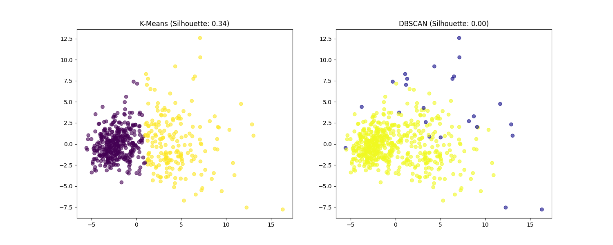

# Unsupervised Learning: PCA & Clustering Analysis

### Diagnosi Automatica tramite Raggruppamento Geometrico

Questo progetto esplora come gli algoritmi di apprendimento non supervisionato possano identificare pattern in un dataset medico (Breast Cancer Wisconsin) senza l'uso di etichette preventive.

## Metodologia

Poiché il dataset originale presenta 30 dimensioni, è stata applicata la **PCA (Principal Component Analysis)** per proiettare i dati in uno spazio 2D, facilitando la visualizzazione e riducendo il rumore.

## Analisi dei Risultati

Il confronto tra gli algoritmi ha evidenziato differenze strutturali profonde:

| Metrica              | K-Means                              | DBSCAN                                    |
| :------------------- | :----------------------------------- | :---------------------------------------- |
| **Silhouette Score** | **0.3434**                           | 0.0000                                    |
| **Interpretazione**  | Buona separazione lineare lungo PC1. | Fallimento nel rilevare densità separate. |
| **Punti di Rumore**  | 0 (tutti assegnati)                  | 24 (isolati come outlier)                 |

### Perchè DBSCAN ha ottenuto 0.00?

Dalle visualizzazioni prodotte, si nota che DBSCAN ha identificato un unico grande cluster "globale", classificando i restanti punti come rumore. Questo accade perché i dati dei tumori sono altamente densi e sovrapposti nello spazio iperdimensionale, rendendo difficile la creazione di "isole" di densità separate.

Al contrario, **K-Means** ha forzato una partizione del dataset che riflette meglio la distinzione clinica tra benigno e maligno osservabile lungo l'asse della prima componente principale (PC1).

## Come replicare

1. Clona il repository.
2. Installa le dipendenze: `pip install scikit-learn matplotlib numpy`.
3. Lancia lo script: `python main.py`.

